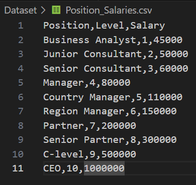

# Unveiling the best fit: Exploring regression models

### Hey everyone!  In this repository, I'll be exploring different machine learning models for a regression problem. My goal is to compare their performance and determine the most suitable model for this specific context. Join me on this journey of discovery!

### Well, let's start. Inside this dataset We have three columns: Position, Level and Salary and we want to predict the salary based on the level job.

### For our purpose, I'm gonna use four kind of regression models which are: Polynomial Regression, Support Vector Machine Regression, Decision Tree and Random Forest. Why we don't use linear regression or multiple linear regression? Because the relationship between variables is not linear, and the models already mentioned are more flexible and they can catch no linear relations.

